# Efficient Revenue Recovery Using Machine Learning 
# Abstract
Collection agencies spends millions of dollars sending letters and making phone calls in order to potentially receive some sort of payment from the debtor. Most of these companies are blindly sending letters and making phone calls to make an effort to retain some form of payment. Data science methods will be applied in attempt to increase right party contact, filter and prioritize accounts, in hopes to increasing collection efficiency and decreasing operational cost. 

**Example:** mailing 500k (arbitrary account numbers) letters to pre-screened individuals, who have a higher likelihood of paying vs. mailing letters to all 2 million individuals. At $0.15 a letter, total cost of $300k, which will save the company $225k or 75% every time they plan on mailing a letter. Same can be applied with phone calls. 

#### Problem statement:

**Can we use machine learning to segment and rank accounts by likelihood of payment using historical accounts?**

# Overview
We knew prior to starting this project that this was a difficult task to take on. We found this to be true, especially during our modeling stage due to extreme data imbalance. During our process, we exhausted our efforts in attempt to reduce imbalanced data, and still did not receive "good" results. We "predicted" this would be the case due to the nature of the dataset i.e. business. Therefore, we utilized multiple machine learning models to exploit features deemed most important, and derived a scoring sytem in order to segement and rank accounts by likehood of payments using historical successes... Which then can be used to prioritize accounts and increase efficiency. As we walk through the README, you'll notice we scrubbed and explore our data in multiple places, and not just at the begining, but the work flow will be consistent with our OSEMiN method. 

# Obtain
**This dataset consist of 5 files:**
- `DB_Accounts_2012-2015.txt` : contains account numbers and account specifics 
- `DB_Splits.txt` : contains payment information 
- `DB_Entities.txt` : contains entity address information 
- `DB_Purchases.txt` : contains account balances purchases and descriptive portfolio information
- `uszips.csv`: contains zip code based economic data 

The final dataset used consist of **12.7 million records with 46 columns.** 
- **13 categorical** and **33 continuous** features

# Scrub 
During this process, we completed most of our feature engineering. We started with cleaning and merging our first of many datasets in our `Cleaning.ipynb`. After modeling, we then created our scoring/grading system in our `Scoring System.ipynb`.

# EDA 
Our exploritory data analysis stage is one of the most opended and one of the most important aspect of the process. During our EDA, we will ask questions about our data and will either find a quick answer or further our our analysis which often results in pulling more data, and/or combining data, which means returning to previous steps. Some questions we'd like to answer to begin with: 

- What is the breakdown between payers and non-payers? 
- Are there any correlation between certain features and our target? 
- Are the numerical features evenly distributed? 

## Gather Sense of Our Data: 
The first thing we must do is gather a sense of our data. 

### Highlights: 
- There are 12,713,917 total accounts and only 556,536 accounts paid in full or settled (considered - paid) 
- We have a total of 46 columns 

#### What is the breakdown between payers and non-payers? 
95.63% are non-payers and only 4.37% are payers

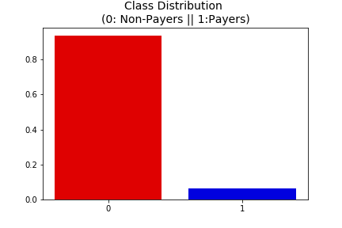

### Are there any correlation between certain features and our target?
We want to see if there are any features that influence `Paid` heavily. As the heatmap below shows, there aren't any features that correlates highly with our target. We also used boxplots to get a better understanding of the distribution of these features. 

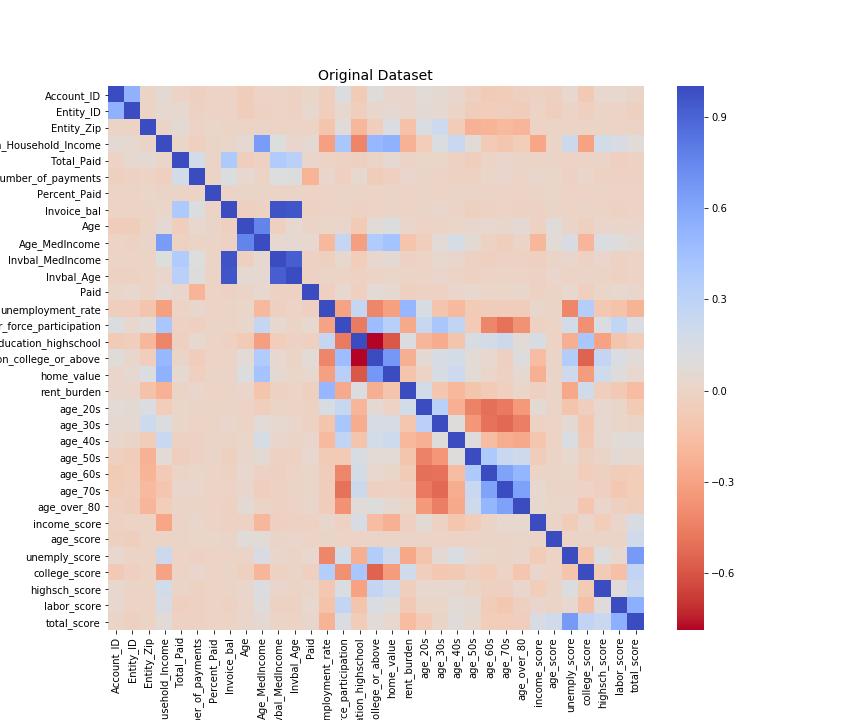

---

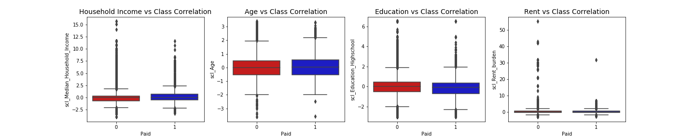

#### Are the numerical features evenly distributed? 

**Checking our numerical feature(s) distribution: Payers vs. Non-Payer**: As the image shows below, our numerical feature(s) distribution between payers and non-payers look very similar. 

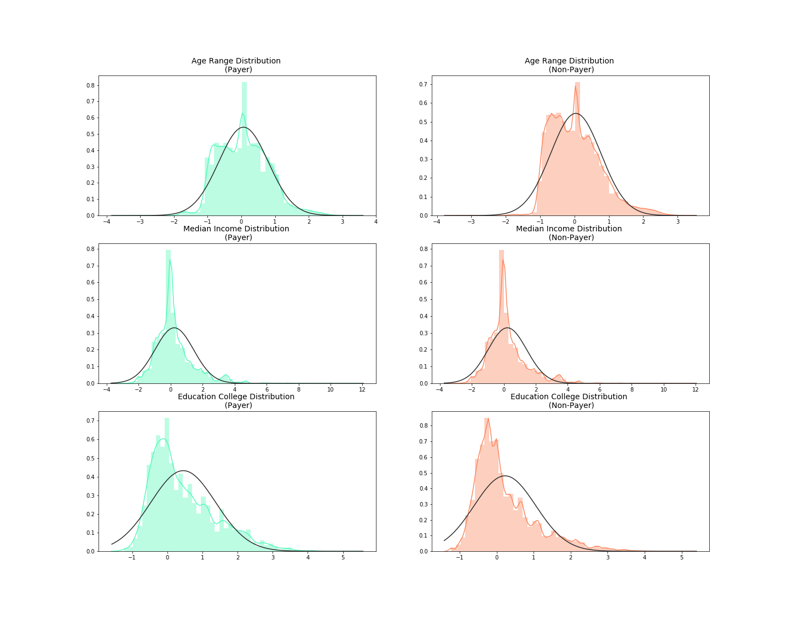

### Summary: 
- Our data is highly imbalanced between payers and non-payers. 
- Our distribution of features between the two classes (Payer and Non-Payer) are pretty even. 
- There really isn't any one feature that correlates highly with our target. 

From our initial EDA, we concluded that our features, has no direct correlations with our target variable. We predicted this might be the case due to our heavily imbalanced data.

# Preparing Our Data
We assume our models will have a difficult time differentiating our classes due to high data imbalance. Knowing this, we implemented "**random under sampling**", which consists of removing data in order to have a more balanced dataset, and avoiding our models to overfitting (as you'll see below). 

- Orginal dataset: **96%** Non-Payers & **4%** Payers 
- Random Under Sampling: **50%** Non-Payers & **50%** Payers

To avoid contamiation of data during our model training, we used a percentage our data, and created a randomly generated subset for each of our dataset and held out a portion of our data for testing. 

**Note:** An issue with "random under sampling" is the information loss, which risk our models to be less accurate. 

# Model 

## [Part I](https://github.com/MyNameisBram/Capstone-Project/blob/master/Model_part2.ipynb)
___

### Dimensionality Reduction and Clustering: 
Here we'll be using some unsupervised algorithms in attempt to reduce dimensionality. 
- [t-SNE](https://towardsdatascience.com/an-introduction-to-t-sne-with-python-example-5a3a293108d1): Non-linear technique for data exploration and visualizing high-dimensional data. Developed in 2008.
- PCA: Linear dimension reduction techique that seeks to maximize variance and preserves large pairwise distance. Developed in 1933. 
- Truncated Singular Value Decomposition (SVD): Similar to PCA, but the factorization is done on the data matrix vs. PCA, where factorization is done on the covariance matrix.

### Summary: 
- Even after balancing our data, the algorithms failed to accurately cluster the classes (payers vs. non-payers) 
- This gives us an indication that further predictive models will perform poorly in identifying the classes. 

#### Imbalanced Dataset Clustering:
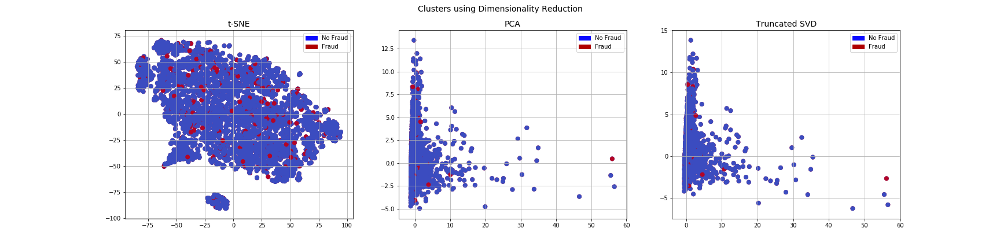

#### Balanced Dataset 50/50 Clustring:
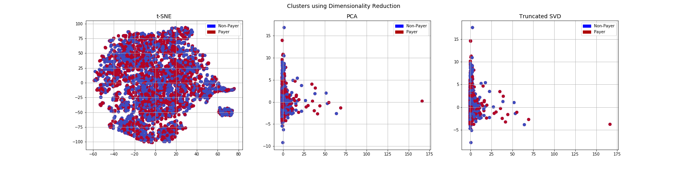

## [Part II](https://github.com/MyNameisBram/Capstone-Project/blob/master/Model_part2.ipynb)
___

### Classifiers: 
In this section we'll train four types of classifiers to see which will be more effective in detecting if someone is a payer or not. We ran our models using two different datasets. The original highly imbalance data, and a **Random under-sampling** dataset, which consists removing data to create a distribution of 50/50 payers and non-payers. Our initial models with the imbalance data had awesome/near perfection scores. This is due to the nature of our imbalance data, with our models identifying 96% of each accounts as "non-payers" i.e. overfitting. 

### Summary:
- **SVM (support vector machine)** classifier has the highest accuracy of the four, with Logistic Regression and Random Forest being a close second place. 
- **GridsearchCV** is used to determine the parameters that gives us the best predictive score. 
- SVM has the best **ROC score**, meaning that SVM identified payers from the non-payers better than the other three algorithms. 

### Learning Curves: 
- The wider the gap between the training score and the cross validation score, the more likely your model is **overfitting**, i.e. **high variance**.
- If the score is low for both, this indicates that our model is **underfitting** i.e. **high bias**.
- SVC showed the best score score with 67.5% 

___
#### Score:

#### ROC Curve:
___
#### Imbalanced Dataset 
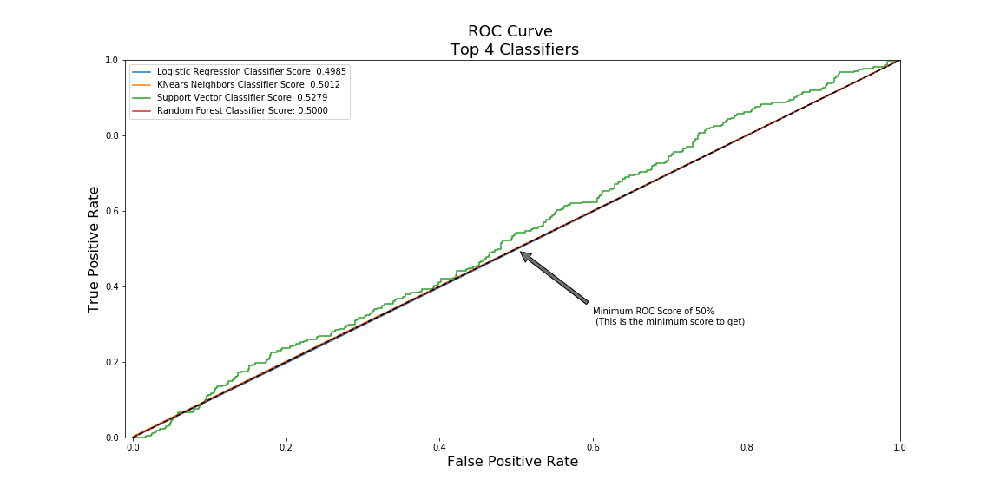

#### Balanced Dataset
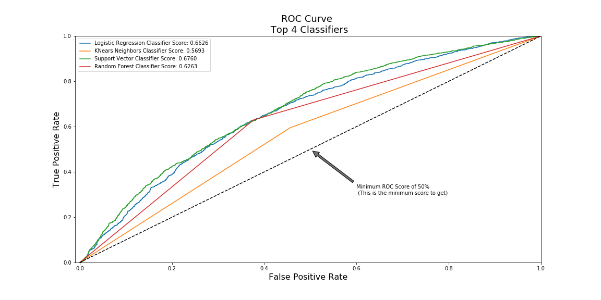

#### Learning Curve: Balanced Dataset
___ 
         
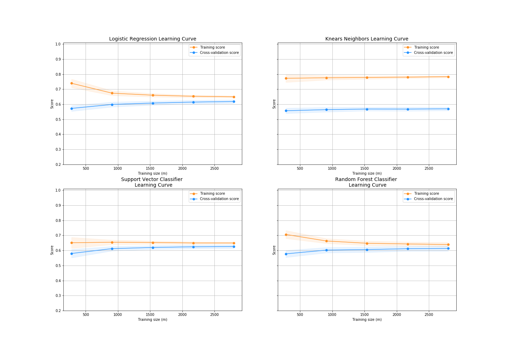

### Confusion Matrix: 
---
**Positive/Negative:** Type of Class (label) [0, 1] True/False: Correctly or Incorrectly classified by the model.

- **True Negatives** (Top-Left Square): This is the number of correct classifications of the Non-Payer class. 
- **False Negatives** (Top-Right Square): This is the number of incorrect classifications of the Non-Payer class. 
- **False Positives** (Bottom-Left Square): This is the number of incorrect classifications of the Payer class 
- **True Positives** (Bottom-Right Square): This is the number of correct classifications of the Payer class.

### Summary: 
- **Classification Models**: The models that performed the best were **logisitic regression** and **support vector classifier (SVM)**. 
- Our over all precision/recall score is not great, but better (not overfitting) vs. our imbalanced dataset. 

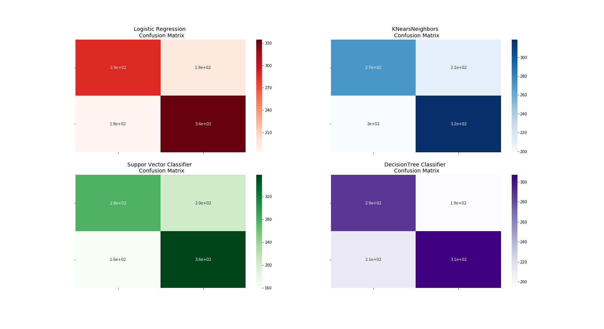
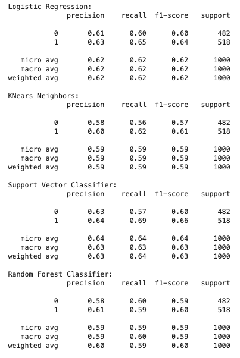

## [Part III](https://github.com/MyNameisBram/Capstone-Project/blob/master/Model_part2.ipynb)
--- 
### Neural Networks:
In this section we will implement a simple Neural Network with two hidden layers in order to see which of the two logistic regressions models we implemented in the (undersample or oversample(SMOTE)) has a better accuracy for detecting payers and non-payers. 

- We will use our **random undersampled** subset and our **SMOTE** dataset in order to predict to predict the final result using the original testing dataset. 
- **Neural Network**: We composed a neural network which consists of two hidden layers with 46 nodes per layer (number of features) and an output node composed of two possible outcomes 0 or 1 ( Non-Payer and Payer)
- **Other Features**:
    - Learning rate: 0.001
    - Optimizer: AdamOptimizer
    - Activation function: `'relu'` and `'sigmoid'` for the output
    - Loss: `'sparse_catergorical_crossentropy'`, which provides the probabiliyt wheter an instance is non-payer or payer
    

### Goal: 
Our main goal is to explore how our simple neural network behaves with our two datesets and see if they are able to predict accurately between the two classes (payer and non-payer). 
    
### Summary: 
- Using SMOTE on our imbalanced data helped with identifying our imbalanced labels. 
- Our simple neural network was able to identify "Payer" class better than our other models but at at the cost of increased **missed identification** of our True Positive or "Non-Payer", meaning our SMOTE NN missclassifed our "Non-Payers" as "Payers". Which bring us to a similar issue in which we hope to disclose. 

### Confusion Matrix:
---
#### Random Under Sample:
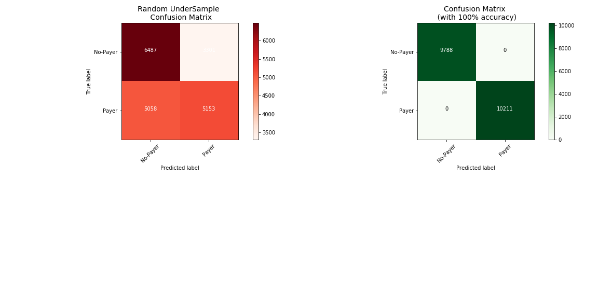

#### SMOTE:
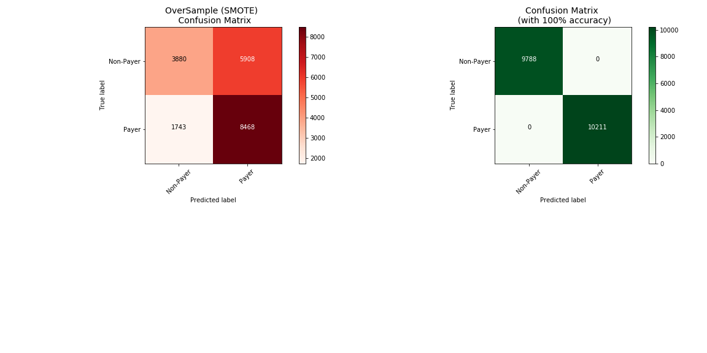

# Conclusion
--- 
We concluded that our models performed better than a 50/50 coinflip, by an average of 10-15% more. We are disatified with the scores we received. However we utilized our findings to create a scoring system for collection agencies to rank/prioritize accounts by likelihood of payment.

### Summary: 
- We were able to use our scoring system i.e. `Grade` in tandem with our findings during our EDA, to segment accounts and target those who has a higher likelihood of payment. 
- Grouping by `Grade`, `Age_range`, and `Income_level`, we were able to identify accounts with a higher `Percent_Paid`, i.e. likelihood of payment. 

### Next Steps: 
- Scrape zip code based consumer behavioral data (if possible) and combine with our current features.
- Use sensitive information i.e. ss#, gender, sex and race. 
- We would like to create a pipeline from receiving our data, OSEMiN process (clean,modeling, ect.), and create a user friendly dash board that collection agencies can utilize. 
- We also would like to compare our scoring system i.e. "likelihood" of payment vs. other scoring systems in the market place. 

### [Scoring System:](https://github.com/MyNameisBram/Capstone-Project/blob/master/Scoring%20System.ipynb)
- We utilized our models' feature importance to "score" our categorical features.With `Grade` `A` being the most likelihood of payment and `F` with the least likelihood of payment.
- `Grade`: 
    - A > Aa > Aaa
    - B > Bb > Bbb
    - C > Cc
    - D > Dd
    - F 

#### Grade Breakdown: 
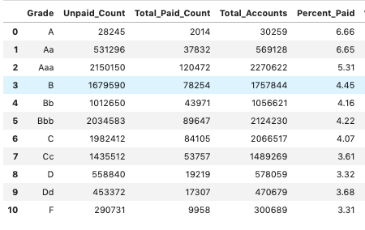

#### Grade `A` Breakdown - Group by `Grade`, `Age_range`, and `Income_level`:
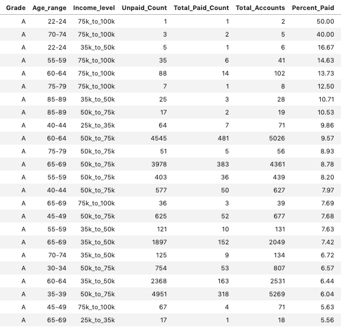
